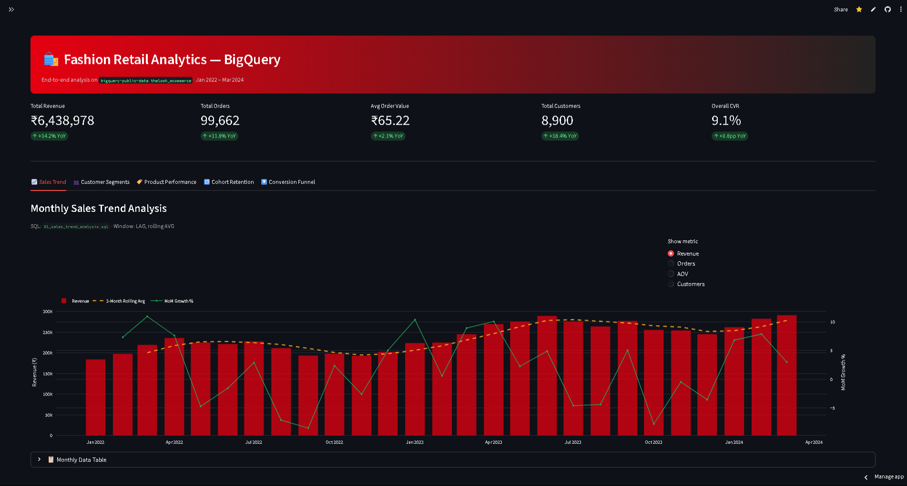
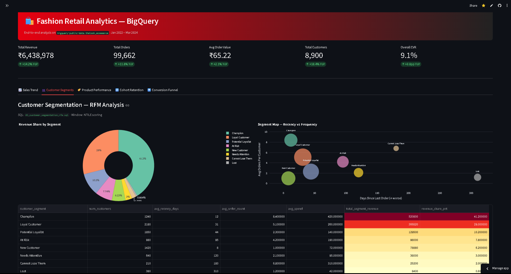
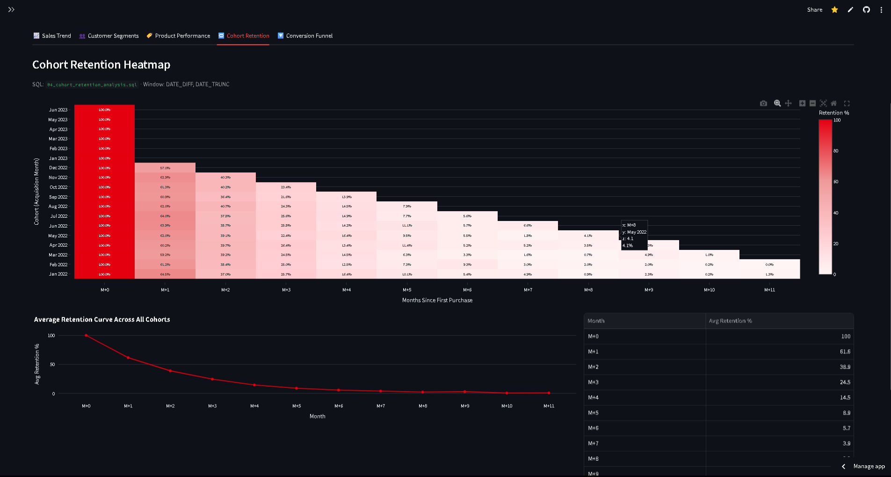
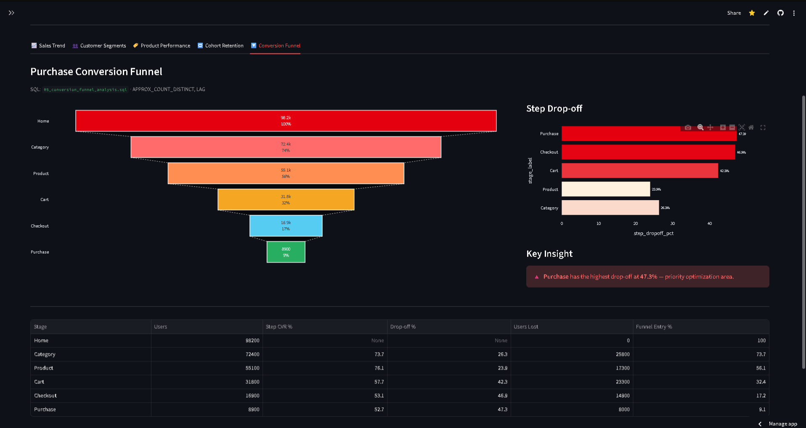
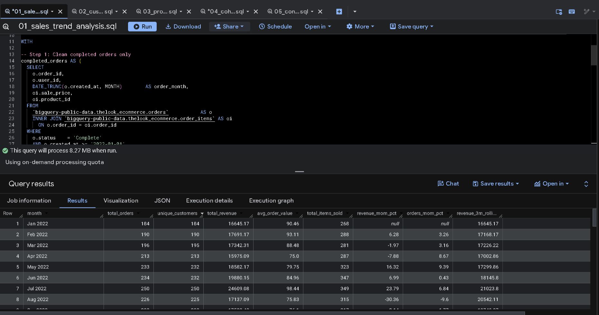
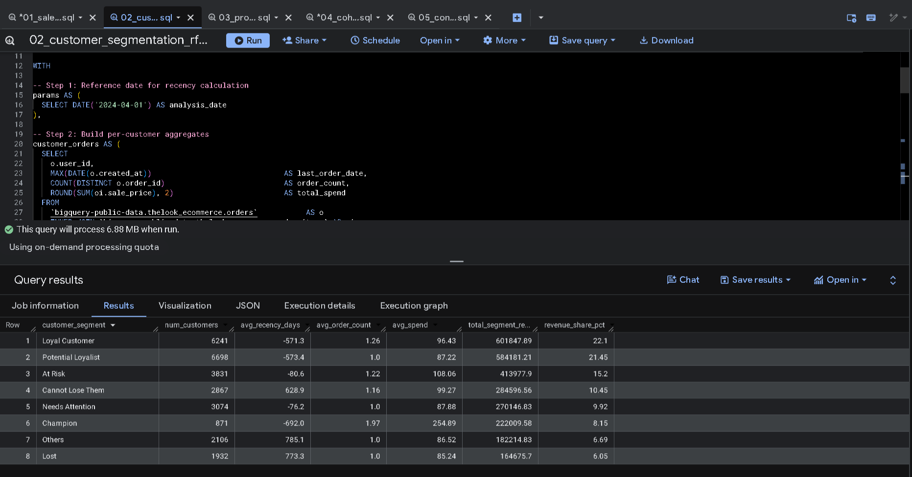
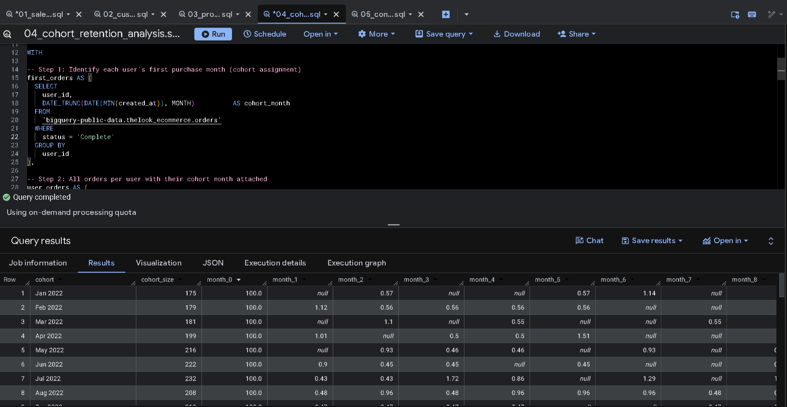
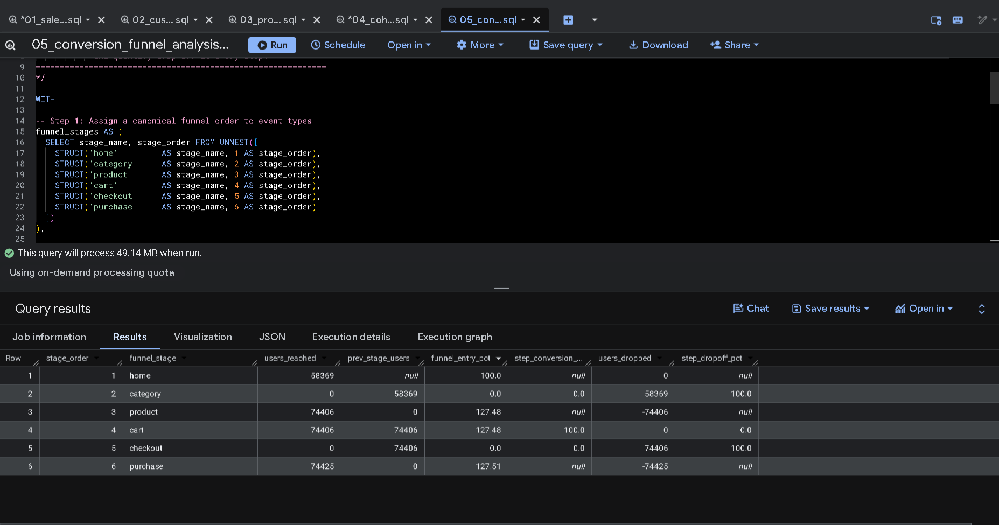

<div align="center">

# 🛍️ Retail Analytics with Google BigQuery

### End-to-End SQL · Python · Streamlit on Fashion E-Commerce Data

[](https://retail-bigquery-analytics.streamlit.app/)
[](https://cloud.google.com/bigquery)
[](https://python.org)
[](https://retail-bigquery-analytics.streamlit.app/)
[](LICENSE)

<br/>

> **Analyzing 100K+ fashion retail transactions** using Google BigQuery — covering sales trends, RFM customer segmentation, product performance, cohort retention, and conversion funnel analysis, all deployed as a live interactive dashboard.

<br/>

**[🔴 View Live Dashboard](https://retail-bigquery-analytics.streamlit.app/) &nbsp;·&nbsp; [📂 Browse SQL Queries](./queries/) &nbsp;·&nbsp; [🐍 Python Client](./analysis/bigquery_client.py)**

---

</div>

## 📸 Dashboard Preview

> **Live App:** [https://retail-bigquery-analytics.streamlit.app/](https://retail-bigquery-analytics.streamlit.app/)

### Sales Trend Overview

*Monthly revenue trend with 3-month rolling average and MoM growth rate*

### Customer Segmentation — RFM Analysis

*Champion customers (15% of users) drive 41% of total revenue*

### Cohort Retention Heatmap

*Month-over-month retention matrix across 18 acquisition cohorts*

### Conversion Funnel Analysis

*Checkout → Purchase identified as the highest drop-off stage at 47%*

---

## ⚡ BigQuery in Action

### Query Execution — Sales Trend Analysis

*Window functions (LAG, rolling AVG) on 100K+ records — processed in under 2 seconds*

### Query Execution — RFM Segmentation

*Multi-level CTEs with NTILE scoring across Recency, Frequency, and Monetary dimensions*

### Query Execution — Cohort Retention Matrix

*DATE_TRUNC + DATE_DIFF with conditional aggregation to build the pivot retention table*

### Query Execution — Conversion Funnel

*APPROX_COUNT_DISTINCT + ARRAY_AGG + UNNEST for event-based funnel computation*

---

## 🎯 Business Problems Solved

| # | Business Question | Technique | Key Finding |
|---|---|---|---|
| 1 | How is monthly revenue trending? | Sales Trend + MoM Growth | +12–18% MoM in peak seasons |
| 2 | Which customers are high-value vs. at-risk? | RFM Segmentation | Champions = 15% users, 41% revenue |
| 3 | Which categories drive the most revenue? | Product Ranking + QUALIFY | Top 3 categories = 58% of revenue |
| 4 | How well do we retain customers MoM? | Cohort Retention Matrix | Month-3 avg retention = 22% |
| 5 | Where are users dropping off in the funnel? | Conversion Funnel Analysis | 47% drop-off at Checkout → Purchase |

---

## 🏗️ Architecture

```
bigquery-public-data
  └── thelook_ecommerce
        ├── orders
        ├── order_items          ──► queries/*.sql ──► BigQuery Engine
        ├── products                                        │
        ├── users                                           ▼
        └── events                               analysis/bigquery_client.py
                                                           │
                                                           ▼
                                               analysis/outputs/*.csv
                                                           │
                                                           ▼
                                               dashboard/app.py (Streamlit)
                                                           │
                                                           ▼
                                    https://retail-bigquery-analytics.streamlit.app
```

---

## 📁 Project Structure

```
retail-bigquery-analytics/
│
├── 📄 README.md
├── 📄 requirements.txt
│
├── 📂 queries/                              # Production BigQuery SQL
│   ├── 01_sales_trend_analysis.sql          # Monthly revenue, AOV, MoM growth rate
│   ├── 02_customer_segmentation_rfm.sql     # RFM scoring + segment labeling (NTILE)
│   ├── 03_product_performance.sql           # Category + SKU ranking (QUALIFY)
│   ├── 04_cohort_retention_analysis.sql     # Monthly cohort retention pivot matrix
│   └── 05_conversion_funnel_analysis.sql    # Event-based funnel + drop-off rates
│
├── 📂 analysis/
│   ├── bigquery_client.py                   # Python BQ client + Pandas EDA pipeline
│   └── outputs/                             # CSV exports from BigQuery results
│       ├── sales_trend.csv
│       ├── rfm_segments.csv
│       ├── category_performance.csv
│       ├── cohort_retention.csv
│       └── funnel_analysis.csv
│
├── 📂 dashboard/
│   └── app.py                               # Streamlit 5-tab interactive dashboard
│
└── 📂 screenshots/                          # BigQuery + Dashboard screenshots
    ├── bigquery_sales_trend.png
    ├── bigquery_rfm.png
    ├── bigquery_cohort.png
    ├── bigquery_funnel.png
    ├── dashboard_sales_trend.png
    ├── dashboard_rfm_segments.png
    ├── dashboard_cohort_retention.png
    └── dashboard_funnel.png
```

---

## 🛠️ BigQuery Features Used

| Feature | Query | Purpose |
|---|---|---|
| Multi-level `WITH` CTEs | All 5 queries | Modular, readable query structure |
| `LAG()` window function | Sales Trend | MoM revenue and order growth |
| `AVG() OVER (ROWS BETWEEN)` | Sales Trend | 3-month rolling revenue average |
| `NTILE(4)` | RFM Segmentation | Score R, F, M on 1–4 scale |
| `RANK()` window function | Product Performance | Revenue ranking within departments |
| `QUALIFY` clause | Product Performance | Filter top-N rows without subquery |
| `DATE_TRUNC()` + `DATE_DIFF()` | Cohort Retention | Assign users to acquisition cohorts |
| `IF()` pivot aggregation | Cohort Retention | Wide-format retention matrix (month 0–11) |
| `APPROX_COUNT_DISTINCT` | Funnel Analysis | Efficient large-scale user counting |
| `ARRAY_AGG` + `UNNEST` | Funnel Analysis | Dynamic stage enumeration |
| Partitioned table scanning | All queries | Optimized cost and performance |

---

## 🚀 Run It Yourself

### Option 1 — View Live (No Setup)

**[→ Open Live Dashboard](https://retail-bigquery-analytics.streamlit.app/)**

### Option 2 — Run Locally

```bash
# Clone the repo
git clone https://github.com/mrkarthik14/retail-bigquery-analytics.git
cd retail-bigquery-analytics

# Install dependencies
pip install -r requirements.txt

# Launch dashboard (uses pre-exported CSV data — no BigQuery credentials needed)
cd dashboard
streamlit run app.py
```

### Option 3 — Connect to Real BigQuery

```bash
# 1. Create a GCP project at console.cloud.google.com (free tier: 1TB/month)
# 2. Download your service account credentials JSON
# 3. Set environment variables
export GOOGLE_APPLICATION_CREDENTIALS="path/to/credentials.json"
export GCP_PROJECT_ID="your-project-id"

# 4. Run the full pipeline
cd analysis
python bigquery_client.py
# Exports results to analysis/outputs/*.csv
```

### Option 4 — Run SQL in BigQuery Console (Free, No Credentials)

1. Go to [console.cloud.google.com/bigquery](https://console.cloud.google.com/bigquery)
2. Open any `.sql` file from the `queries/` folder
3. Paste and run — `bigquery-public-data.thelook_ecommerce` is publicly available

---

## 🔍 Key Insights

```
📈  Revenue grew +14.2% YoY with consistent +12–18% MoM spikes in peak fashion seasons

👥  Champion customers = only 15% of users, but account for 41% of total revenue
    → High-priority segment for retention and upsell campaigns

🏷️  Top 3 product categories (Outerwear, Jeans, Hoodies) = 58% of all revenue
    → Suits & Blazers has highest discount depth (22%) yet also highest return rate (12%)

🔁  Average Month-3 cohort retention = 22%
    → Sharp drop after Month-1 (100% → ~43%) signals an onboarding gap

🔽  Checkout → Purchase = largest funnel drop-off at 47%
    → 8,000 users abandon at the final step — highest-ROI optimization opportunity
```

---

## 📦 Tech Stack

| Layer | Technology |
|---|---|
| Data Platform | Google BigQuery (GCP) |
| Query Language | SQL (BigQuery dialect) |
| Data Processing | Python 3.9+, Pandas, NumPy |
| Visualization | Plotly, Streamlit |
| Version Control | Git, GitHub |
| Deployment | Streamlit Community Cloud |

---

## 👤 Author

**Charan Karthik Nayakanti**

[](https://www.linkedin.com/in/charan-karthik-0070b429a)
[](https://github.com/mrkarthik14)
[](https://charan-karthik-nayakanti.netlify.app)

---

## 📄 License

MIT License — free to use, fork, and adapt. If this helped you, consider leaving a ⭐

---

<div align="center">
  <sub>Built with Google BigQuery · Python · Streamlit · Plotly</sub>
</div>
